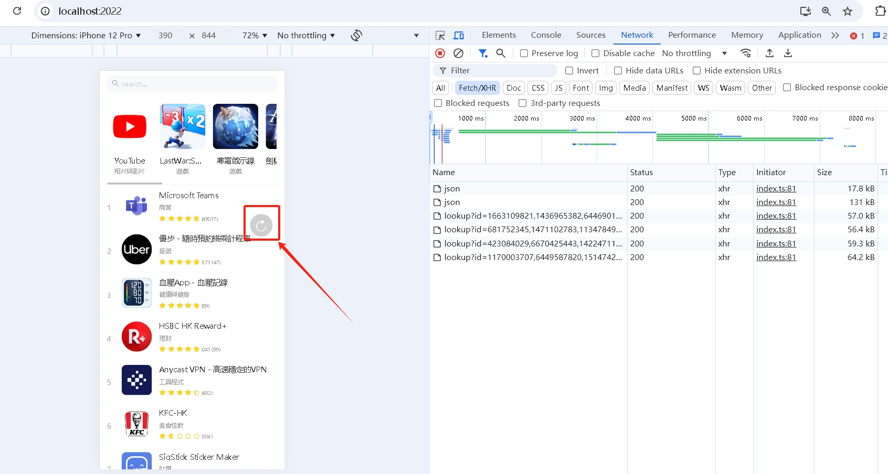
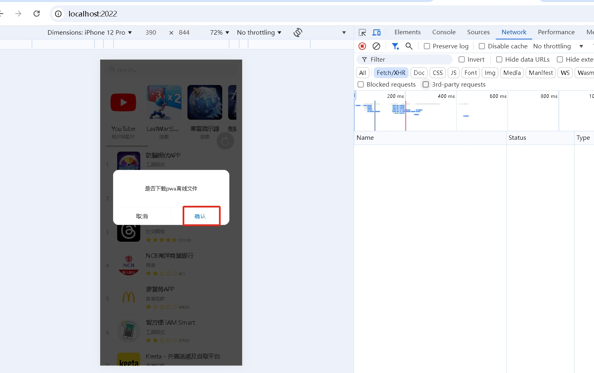
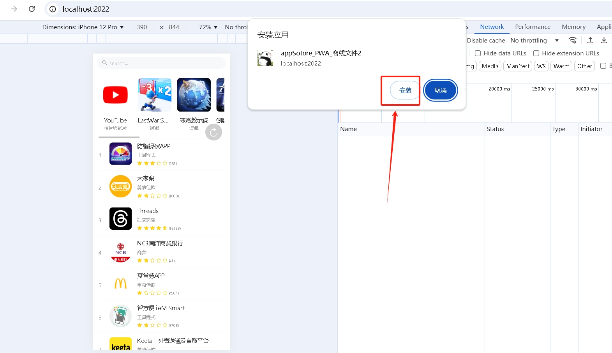
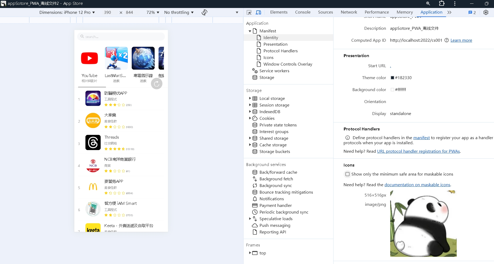
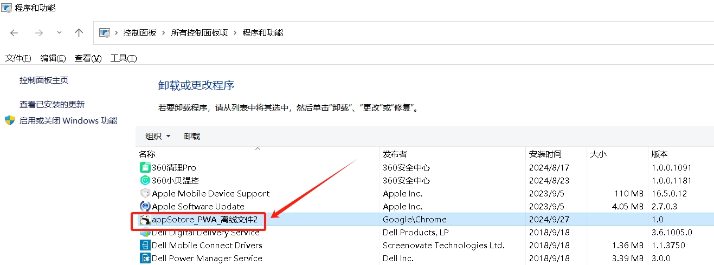

<!--
 * @Author: chenqiaomin
 * @Date: 2024-09-25 00:36:16
 * @LastEditors: chenqiaomin@bxqqedu.com chenqiaomin@bxqqedu.com
 * @LastEditTime: 2024-09-27 19:36:43
 * @FilePath: app-store\appstore\README.md
 * @Description: 应用商场项目，基于 Vue3 + Vite + vant + TypeScript 的前端项目。
-->
##  项目介绍

app应用商城列表页，基于 Vue3 + Vite + vant + TypeScript 的前端项目。


## 项目安装与使用

1. 安装依赖

```sh
npm install 

# 或者

pnpm install
```

2. 启动项目

```sh
npm run dev

# 或者

pnpm run dev
```

3. 访问应用

打开浏览器，访问 http://localhost:2022。

4. 构建项目

```sh
npm run build

# 或者

pnpm run build
```


## 项目结构

```
/appstore
│
├── /src                # 源代码目录
│   ├── /apis           # 接口目录
│   ├── /assets         # 静态资源目录，如图片、字体等
│   ├── /components     # 组件目录
│   ├── /router         # 路由目录
│   ├── /styles         # 样式文件目录
│   ├── /types          # 类型定义文件目录
│   ├── /utils          # 工具函数目录
│   ├── /views          # 视图目录
│   ├── App.vue         # 主应用程序文件
│   └── main.ts        # 入口文件
│
├── /public             # 公共目录，静态文件
│   ├── logo.png        # pwa 图标
│   └── favicon.ico     # 网站图标
│
├── .env                # 环境变量配置文件
├── .eslintrc.js        # ESLint 配置文件
├──  vite.config.ts      # Vite 配置文件
├── .gitignore          # Git 忽略文件
├── package.json        # 项目依赖和配置文件
└── README.md           # 项目说明文件
```

## 缓存与强制刷新

1. 首次进入页面，会请求数据，并缓存到本地，下次进入页面，会优先从缓存中获取数据，无需请求数据。

实现 storage 方法，采用 indexedDB 结合 localstorage 进行数据存储

相关代码 在 appstore\src\utils\db.ts 和 appstore\src\utils\index.ts 中
 
2. 如果需要强制刷新，点击页面上强制刷新按钮，会请求数据，并更新缓存。




## pwa 离线下载

1. 检测到当前环境支持 pwa， 就弹窗提示用户是否下载离线包。



2. 点击确定按钮，会打开一个 浏览器 prompt，下载离线包。



3. 点击安装，完成后，直接离线文件。



4. 本地电脑桌面也生成一个快捷键


5. 要重新生成的话，需要在控制面板中卸载，清除浏览器所有缓存，然后重新安装。

